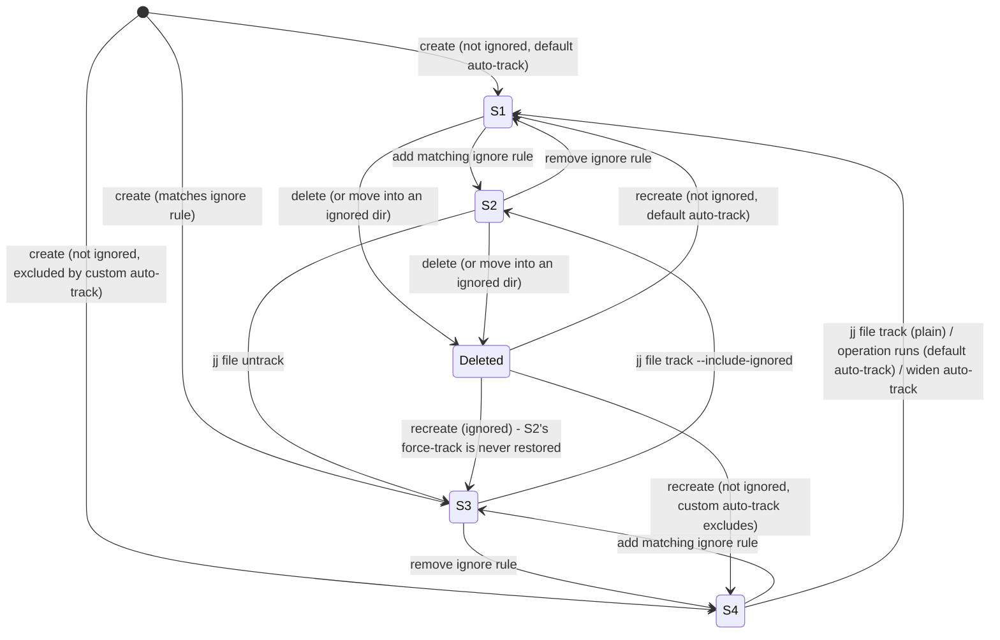

# jj file tracked/ignored state model

This document explains how jj decides whether a file is part of your commit, and how that
interacts with `.gitignore`. It isn't laid out anywhere in jj's own documentation, and working it
out empirically (against jj 0.37.0) turned up a few surprises that materially affect how tooling
(including this plugin) should reason about file state. See `jj-idea-i9ol`.

## Two independent facts, and one crucial asymmetry

Every path in a jj working copy has two independent boolean facts:

- **Tracked** — is this path present in the current commit's (`@`'s) tree?
- **Ignored** — does this path match a pattern in `.gitignore` or `.git/info/exclude`?

These are genuinely orthogonal — jj's own behavior treats them as two separate checks, not one
combined state — which gives four possible states (below).

**The crucial asymmetry**: "tracked" is always reliably knowable. `jj file list <path>` is a live,
authoritative query — non-empty output means tracked, empty output (with a stderr warning) means
untracked. "Ignored" is **never** reliably knowable by anything outside jj itself. jj exposes no
"is this path ignored" query, and any external tool's own `.gitignore` parser — including this
plugin's — is a heuristic that, at minimum, can't see **global** git excludes
(`core.excludesFile`, e.g. `~/.gitignore`) the way jj does. This gap applies equally to all four
states below, not specifically to "tracked and ignored" — it's easy to mistakenly think the
ambiguity is special to that combination, but it isn't.

## The four states

| State | Detection | jj behavior |
|---|---|---|
| **S1** — Tracked, not-ignored (ordinary file) | `jj file list <path>` → present | Normal: auto-snapshotted every command; shows as M/A/D when changed |
| **S2** — Tracked, ignored (force-tracked, or tracked before a rule existed) | `jj file list <path>` → present (**identical signal to S1** — tracked-ness alone can't distinguish these two); ignored-guess reliable only for project-local rules | **Behaviorally identical to S1** in every way except one: `jj file untrack` succeeds here, and fails with "not ignored" on an S1 file. That's the entire observable difference |
| **S3** — Untracked, ignored (the common case: build artifacts, etc.) | `jj file list <path>` → absent | Never auto-tracked, never appears in `jj status`/`jj diff`, even if edited, until `jj file track --include-ignored` or the ignore rule is removed |
| **S4** — Untracked, not-ignored (rare) | `jj file list <path>` → absent | Transient under the default `snapshot.auto-track = all()` (auto-tracked on the very next jj command); persists indefinitely only if `snapshot.auto-track` is configured to exclude the path |

`jj file list` cannot distinguish *why* a path is untracked — verified empirically: querying an
ignored-and-never-tracked path, a path excluded only by a custom `snapshot.auto-track` pattern,
and a path that doesn't exist at all, all produce the byte-identical
`Warning: No matching entries for paths: <path>`, exit 0.

## Transition table

Rows are the state before the event; cells are the state after.

| From ↓ / Event → | Add matching ignore rule | Remove matching ignore rule | `jj file track` (plain) | `jj file track --include-ignored` | `jj file untrack` | Operation runs (time passes) | Delete then recreate |
|---|---|---|---|---|---|---|---|
| **S1** | → **S2** (stays tracked — an existing tracked file is never retroactively dropped just because a new rule now matches it) | n/a (no rule) | no-op, stays S1 | no-op, stays S1 | **fails** ("not ignored"), stays S1 | stays S1 | file leaves the tree (shows as `D` relative to parent); recreating re-evaluates fresh as S1 or S4 per current rules — no memory of the old tracked state |
| **S2** | n/a (already matched) | → **S1**, immediately — "ignored" is a live check on every invocation, not a sticky flag (verified: untrack then fails with "not ignored") | no-op, stays S2 | no-op, stays S2 | succeeds → **S3** | stays S2 | **→ S3, always.** Force-tracking is *never* remembered once the path leaves the tree — recreating (even within the same uncommitted change, even across a real `jj new` commit boundary — both verified) re-evaluates fresh against current ignore rules and lands untracked. `jj status` shows the original as `D` even though a file exists on disk again at that path |
| **S3** | n/a (already matched) | → **S4** momentarily; resolves per the "operation runs" column | **silently no-ops** — this was a real bug in an earlier build of jj-idea-i9ol's Track action, which forgot `--include-ignored` | succeeds → **S2** | no-op, exit 0, stderr warning "no matching entries" — a second bug in that earlier build silently swallowed this instead of surfacing it | stays S3 forever — ignored files are never auto-tracked, under any `snapshot.auto-track` setting | nothing to remove (was never tracked); recreating lands back in S3 if the rule still matches |
| **S4** | → **S3**, immediately (live check; verified indirectly — plain `track` silently no-ops immediately after the rule is added) | n/a (no rule) | succeeds → **S1** — this is `track`'s actual designed use case: a path excluded from auto-track can be tracked manually without `--include-ignored` | succeeds → **S1** (the flag is inert here — there's no ignore rule to override) | **fails** ("not ignored"), stays S4 | **Default config**: auto-tracked on the next command → **S1** (near-instant). **Narrower `snapshot.auto-track` still excluding the path**: stays S4 indefinitely. **Widening `snapshot.auto-track` to include the path**, then any operation: → **S1** (verified) | nothing to remove; recreating re-evaluates fresh |

Two more verified facts that don't fit neatly into the table above:

- **Moving a tracked file's content into an ignored directory is equivalent to delete+recreate**,
  not a rename — verified across a real commit boundary: `jj status` shows `D <old path>` and
  *no* `A <new path>`; `jj file list` no longer shows the file at all. The content survives on
  disk, but tracking does not carry over.
- **Moving an ignored+untracked file's content out of the ignored directory** is picked up
  immediately as a fresh addition under default auto-track (verified: shows as `A <new path>`).
- **Ignored always beats a broad `snapshot.auto-track`** — verified with
  `snapshot.auto-track = 'all()'`: a path matching `.gitignore` still isn't tracked. Only
  `--include-ignored` on an explicit `jj file track` overrides the ignore check; auto-track's own
  pattern is only ever consulted for paths that aren't ignored in the first place.
- **Narrowing `snapshot.auto-track` never un-tracks an already-tracked file** — verified: setting
  `snapshot.auto-track = 'none()'` after a file is already tracked has no effect on it; the
  setting only governs whether *new*, currently-untracked paths get swept in on snapshot.

### The one gotcha worth remembering above all else

**Force-tracking is not sticky.** If a file is force-tracked (S2) and its content is ever deleted
— even for an instant, even within the same uncommitted snapshot, even via a rename into an
ignored directory rather than a literal `rm` — recreating it does **not** restore S2. It silently
becomes S3 again. There is no persistent "this path is force-tracked" flag anywhere; tracked
status is entirely a function of what's currently present in the tree, nothing more. To get back
to S2 you must re-run `jj file track --include-ignored` explicitly.

## State diagram

## Persistence — where is any of this actually stored?

Tracked status isn't stored as separate metadata at all — it's simply presence in the current
commit's tree, the same content-addressed structure that holds file content. There is no side
file, flag, or database entry recording "this path was explicitly tracked" independent of the
tree itself; that's precisely *why* force-tracking isn't sticky (there's nothing else to persist).

For a **colocated** repo, that tree *is* git's own tree object. Verified: deleting `.jj/` entirely
and rebuilding it (`jj git init --colocate`) against the same, untouched `.git/` fully restored
tracked status — including the force-tracked ignored file from before the wipe — because nothing
jj-specific needed to survive; `.jj/` is just a view over git's own object store.

For a **non-colocated** repo, `.jj/`'s own object store is the sole source of truth — there's no
external git repo to rebuild from. Losing `.jj/` there is unrecoverable, the same as losing
`.git/` in a plain git repository. (This half is inferred from jj's storage architecture and the
colocated result above, not separately verified by destructively testing a non-colocated repo.)

## Practical implications for tooling

- `jj file list <path>` is the only reliable way to answer "is this file tracked" — a client-side
  guess (e.g. checking whether a `Change` exists) can't distinguish "tracked and unchanged" from
  "untracked," since only files that *differ* from the parent commit produce a `Change` at all.
- Any client-side "is this ignored" check is fundamentally a heuristic, in every one of the four
  states, not just the ambiguous-looking S2. Plan for it to occasionally disagree with jj — and
  since jj's own behavior for S2 vs. S1 differs *only* in whether `untrack` succeeds, the safest
  fallback when unsure is always to let the `jj file untrack`/`jj file track` command itself be
  the final authority, surfacing its own error rather than pre-emptively hiding the action based
  on an imperfect guess.
